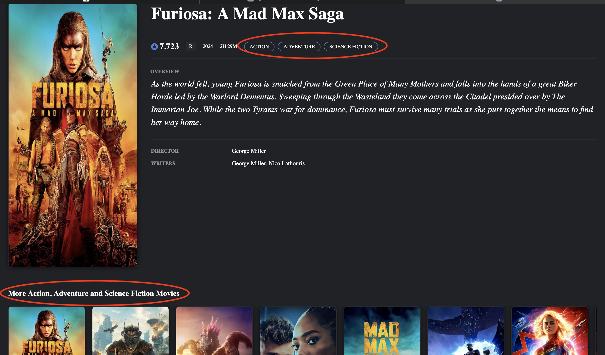
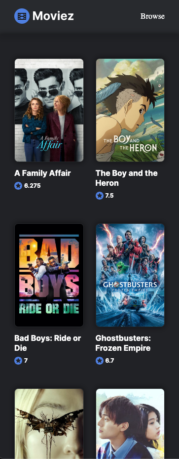
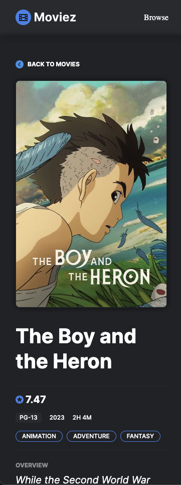
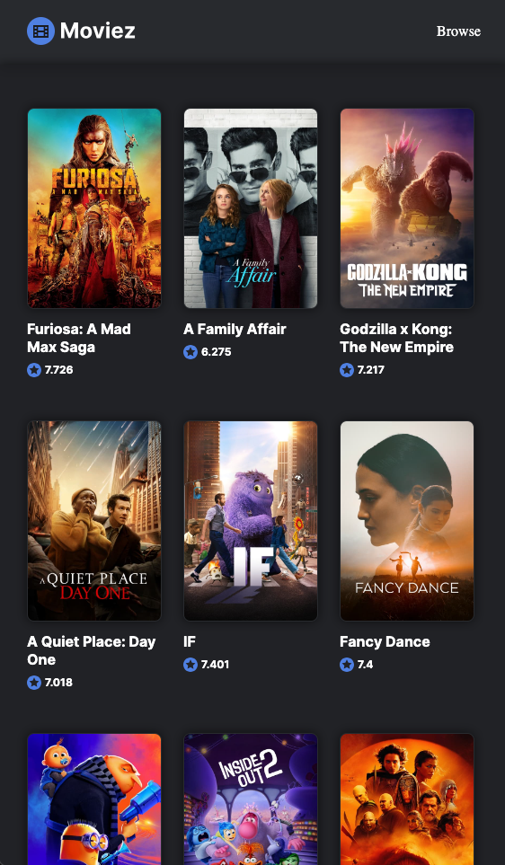
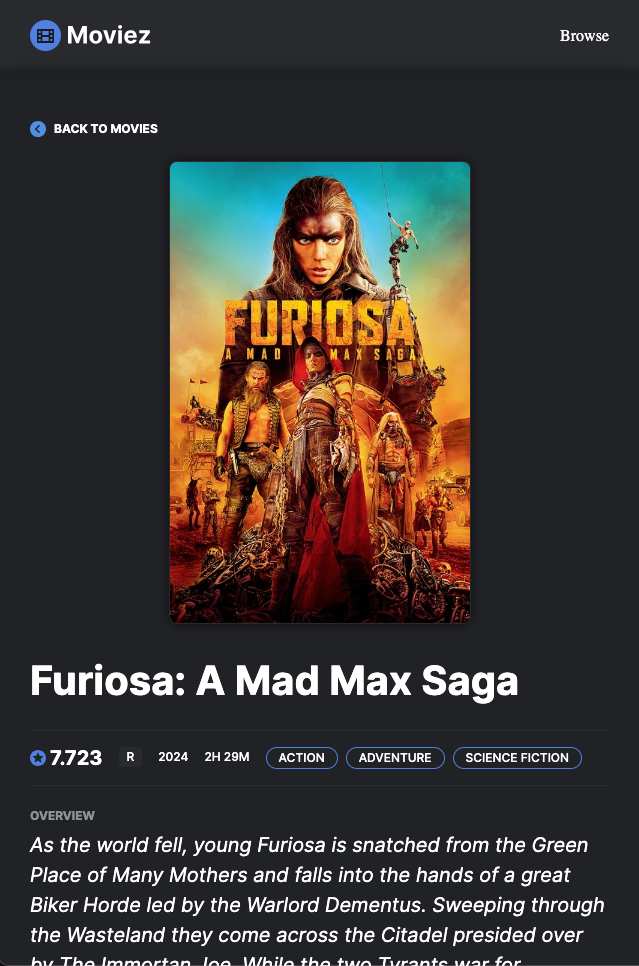
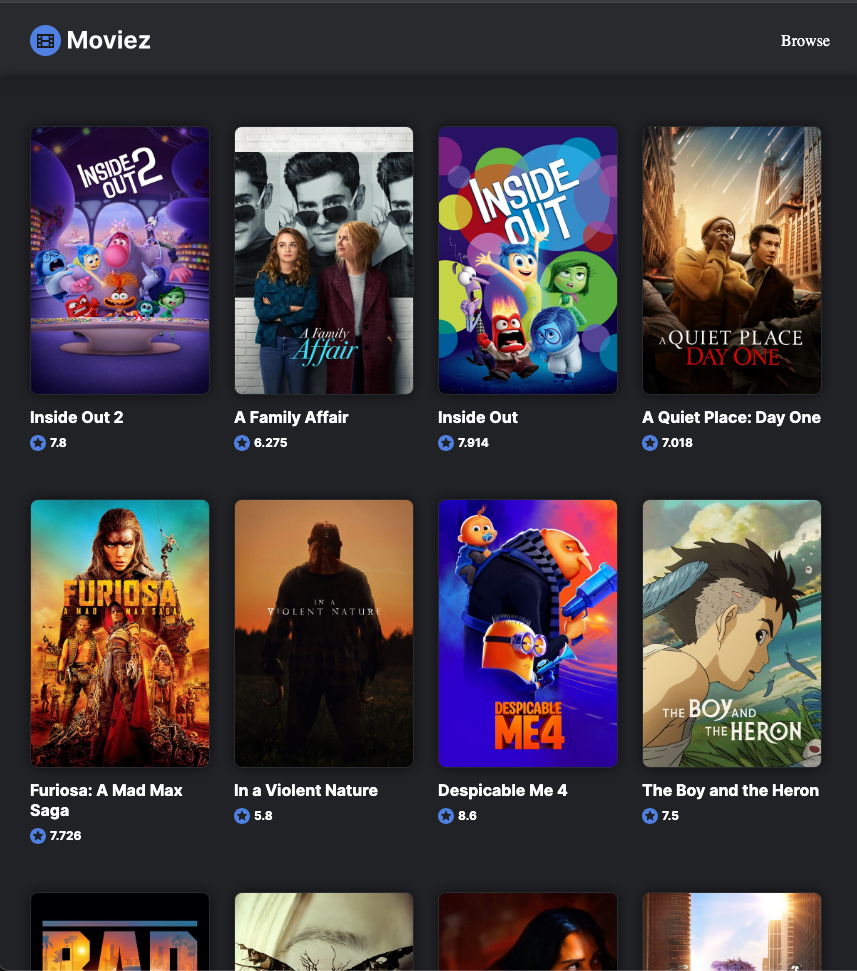
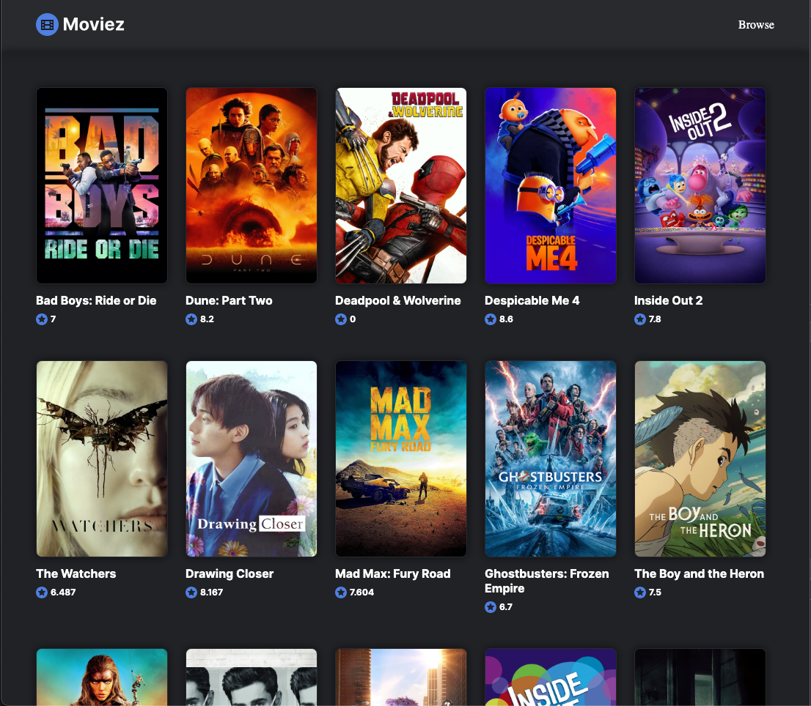
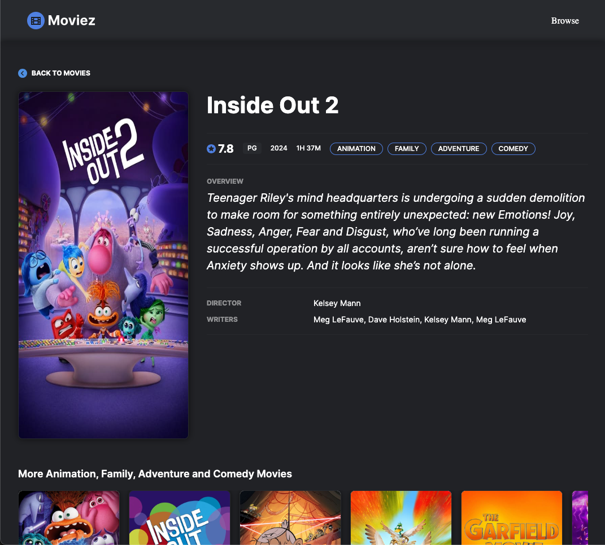
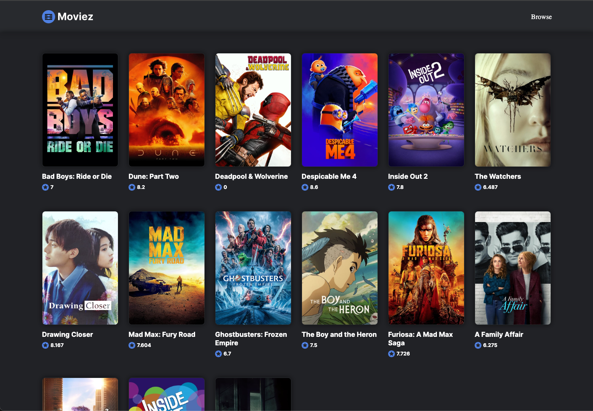

# Movie database Front end coding challenge

## Overview

This is a website project that renders out the data exposed on the Movie Database (TMDB) API end point. The application is structured into a client-server architecture where the client side handles the user interface and the server side manages API requests to the TMDB service.

### Directories and Files

- **client**: Contains the frontend code.
  - **images**: Svg files imported from figma.
  - **details.html**: HTML file for the movie details page.
  - **details.js**: JavaScript file for handling logic on the movie details page.
  - **index.html**: HTML file for the main index page.
  - **index.js**: JavaScript file for handling logic on the main index page.
  - **style.css**: CSS file for styling the application.
  
- **server**: Contains the backend code containing API calls and server.
  - **svr.js**
  
- **template**: Initially, a template was created to enable styling of the index and details page before connecting to the API and creating DOM for the HTML.
  - **04.css**: CSS file for the template.
  - **details.html**: HTML template for the movie details page.
  - **image02.png**: Image file used in the template.
  - **index.html**: HTML template for the main index page.
  
- **.env**: Environment variables file to store API token and keys.
- **package-lock.json**
- **package.json**: Contains information about the application and dependecies used.
- **README.md**

## Getting Started

To get started with the MOVIE_DB project, follow these steps:

1. Clone the repository.
2. Navigate to the project directory.
3. All dependencies are listed in `package.json`. Install the dependencies using `npm install`.
4. Start the server using `npm start` or `node server/svr.js`.
5. Open browser and type `localhost:8080` to view the application.

## Key Features and Functionalilty

The application is responsive and works well on mobile, table, and desktop (small, large, and max).

### Index.html page

1. Renders a list of trending movies fetched from The Movie Database (TMDB) API.

2. On each page refresh/reload, the application shuffles the array of movies listed at random. The movies displayed is sliced to only display 15 movies.

3. The details shown for each movie, is the poster, title, and movie rating. This is following the design given in the Figma design for the page.

4. If a movie is clicked, it redirects and displays details page of that movie.

### details.html page

1. Shows a detailed page for each movie that was clicked from the index page. These includes overview, credits, rating, duration, year of release and genre.

2. Shows similar movies based on the genre of that selected movie. For example, the movie displayed below has a genre of Action, Adventure and Science Fiction. This joins the genres and display `More Action, Adventure and Science Fiction Movies`. Each movie recommended is one of those genres.

## Views on Different Screens

### View on Mobile Device

| Index Page Mobile                                                                 | Details Page Mobile                                                                 |
|-----------------------------------------------------------------------------------|------------------------------------------------------------------------------------|
|  |  |

### View on Tablet

| Index Page Tablet                                                                 | Details Page Tablet                                                                 |
|-----------------------------------------------------------------------------------|------------------------------------------------------------------------------------|
|  |  |

### View on Desktop

| Index Page Small Desktop                                                                 | Index Large Page Desktop                                                                 |
|-----------------------------------------------------------------------------------|------------------------------------------------------------------------------------|
|  |  |

| Details Page Desktop                                                                 | Index Max Page Desktop                                                                 |
|-----------------------------------------------------------------------------------|------------------------------------------------------------------------------------|
|  |  |

## Future improvements

1. Implementing a search feature to enable great use experience and faster way of getting results.

2. Implementing a filter feature to enable filtering of results based on year of release, genre, director or duration.
